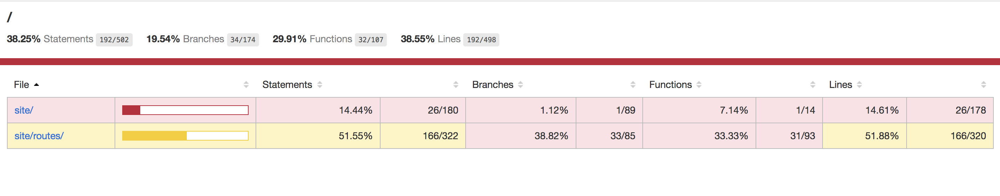
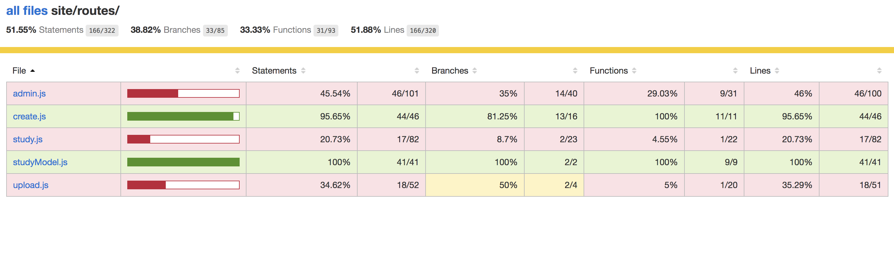
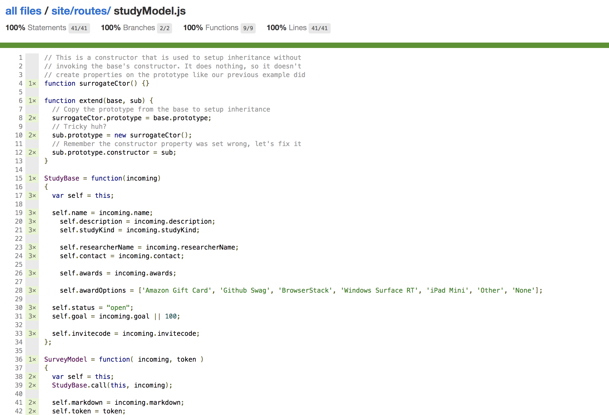
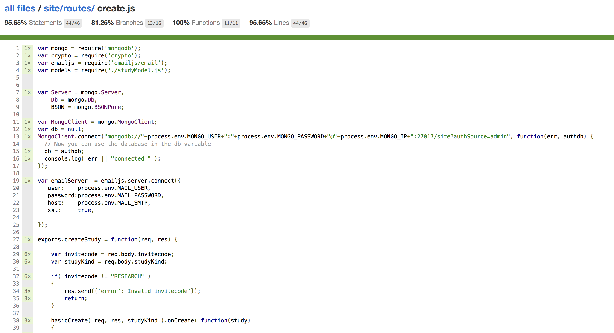
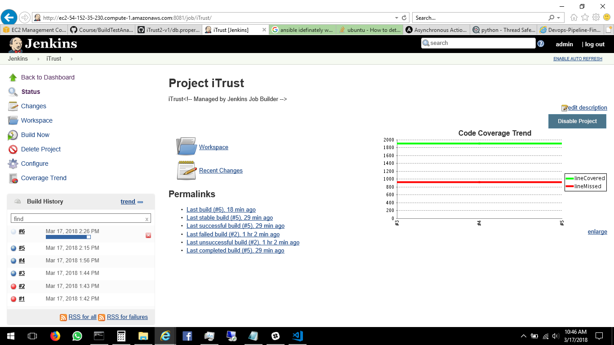
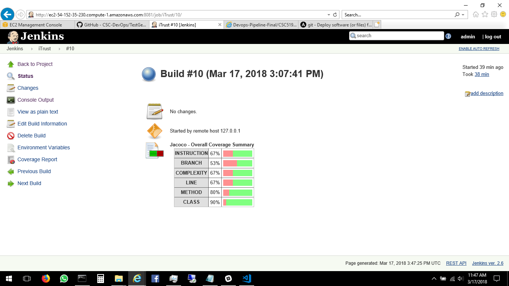
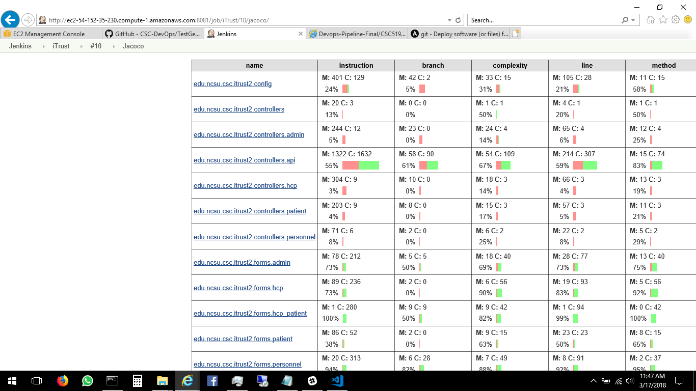
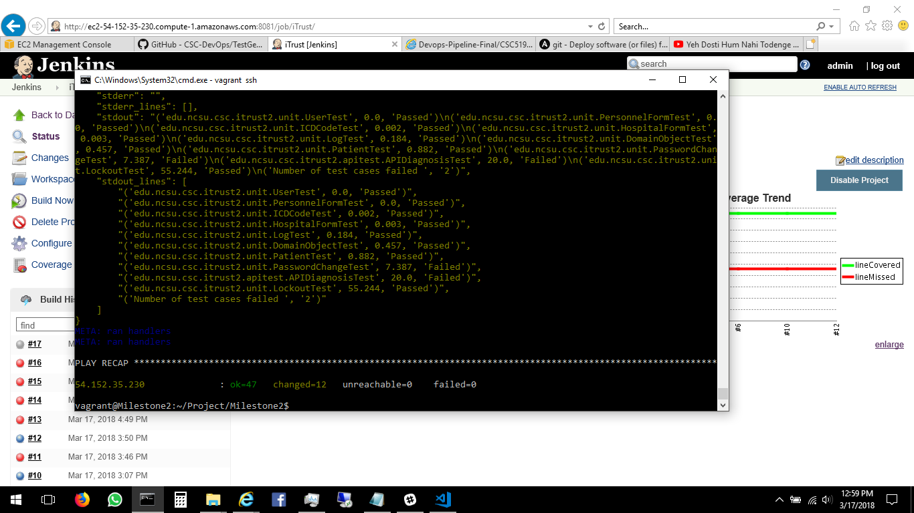

# [Milestone 2 - Test and Analysis Milestone](https://github.com/CSC-DevOps/Course/blob/master/Project/BuildTestAnalysis.md)

## Contribution:

- Anshuman Goel (agoel5) : Automated commit generation using a commit fuzzer and test prioritization for iTrust.
- Divya Guttikonda (dguttik) : Anisble playbooks for configuring remote server and test generation for checkbox.
- Sarat Kavuru (skavuru) : Coverage report generation using Jacoco jenkins plugin for iTrust and ansible playbooks.
- Tanmay Goel (tgoel) : Test generation using istanbul-middleware for Checkbox.

## Screencast
[Screencast for Demo of  Test and Analysis Milestone](https://www.youtube.com/watch?v=qAbsgiIpf8k)

## Report

### Few Notes:

- The ansible-vault file should be named __credys.yml__ and the following credentials should be stored in as key:value pairs (DOTOKEN : 'xxx').
  - AWSAccessKeyId
  - AWSSecretKey
  - git_username
  - git_password
 - AWSAccessKeyId, AWSSecretKey are the accesskeyId and secretKey of an AWS account and git_username, git_password  are the username and password of a Github Ncsu Enterprise account.
- Create an SSH key pair with the name DevOps with your AWS account and store the file in the [Milestone2](../Milestone2) directory. Make sure that this key file has read-write permissions 0400 or 0600.
- All the variables required for [checkbox.io](https://github.com/goeltanmay/checkbox.io) are in the file [checkboxvar.yml](../Milestone2/checkboxvar.yml) and they can be modified as required.
- The Node.js file [aws.js](../Milestone2/aws.js) should always be called with ServerName as an argument.
- The commands to run each playbook are placed as comment at the top of of each playbook.
- The ansible-playbook [node.yml](../Milestone2/node.yml) is used to configure a local vm and then run aws.js to provision a remote server for Jenkins.
- The ansible-playbook [BuildAndTestAnalysis.yml](../Milestone2/BuildAndTestAnalysis.yml) is used to install all the dependencies, setup Jenkins and generate coverage reports for Checkbox and iTrust on a remote server.
- [main.js](../Milestone2/main.js) , [constraint.js](../Milestone2/constraint.js) and [format-polyfill.js](../Milestone2/format-polyfill.js) are files used in automated test generation for checkbox.io application.
- [fuzzer.py](../Milestone2/fuzzer.py) and [test_prioritization.py](../Milestone2/test_prioritization.py) are the python scripts are used for automated commit generation using a commit fuzzer and test prioritazation of the tests respectively.
- [iTrustBuild.yml](../Milestone2/iTrustBuild.yml) is the yml file which is parsed by the jenkins job builder to create an iTrust job on Jenkins server.
- The ansible-playbook [milestone2.yml](../Milestone2/milestone2.yml) is an outer level playbook which executes node.yml and BuildAndTestAnalysis.yml playbook and thus automating the entire Milestone 2 to a single step.

 ### Experience:
Fuzzing changes the source code and helps to analyze the weak points in our testing as well as the source code. If a change in the source code and test pass successfully can mean that there is a missing test case which needs to be rectify. With this milestone we also saw that. In many cases where the build was successful even after fuzzing.

After doing the test prioritization, we came to see some set of failures which are very common or prone to fuzzing or test case failure. The test case which we frequently observe are APIDiagnosisTest and PasswordChangeTest.

As disscussed above, the fuzzer helps to find out the missing test cases which can lead to successful build even though it shouldn't.
The fuzzing helps to prioritize the test case. Extending fuzzing with AI can help improve the prioritization of the test cases more intelligently. For an example, it can help to choose better probability distribution for each type of fuzzing.

There can be multiple reasons for test to be ranked higher. The time elapsed can affect the system. It is often observed that it is one of the major causes. As we build more and more, it required more memory which leads to swapping to disk and slows down the system. After a certain threshold of the system, the system is also not able to allocate any memory as all the memory is being used up. This lead us to change the instance with better memory (both primary and secondar memory) and processor. Other reason can be the number of times the test case that fails. Suppose one test case fails every now and then and obviously will lead to ranked higher in test prioritiation analysis.

#### Approach for Automated Test Generation:
First, we looked up at what all we can test and how we can test. After having a lot of difficulty in understanding, we started writing test cases manually in test.js and using istanbul to check coverage. While writing the manual test.js we realize that we can automate those using esprima. Using esprima online tool helped us to find out about the AST pattern, through which we generated a dictionary which contains all the useful information like function name, file name, the url to hit and type of request (GET/ POST). With the help of this dictionary and the experience of manual test.js we were able to generate the test cases in test.js automatically using testgenerator.js by generating data and calling the url automatically. But this time, we used istanbul-middleware to check the coverage on the server side.

After, the tiring session with Checkbox understanding and shouting on each other, we were finally able to reach aprroximately 50% coverage. :-) We were able to generate test cases for `create.js`,`studyModel.js` and `admin.js`.
 ### Screenshots:

 - __Checkbox.io Overall Coverage Summary__ 

 

 - __Checkbox.io Coverage Summary for Files__ 

 

 - __Checkbox.io studyModel.js coverage__ 

 

 - __Checkbox.io create.js coverage__ 

 

 - __iTrust Jacoco coverage__ 

 

 - __iTrust Jacoco coverage overview__ 

 

 - __iTrust Jacoco coverage detail__ 

 

 - __iTrust Test Prioritization Analysis__ 

 
