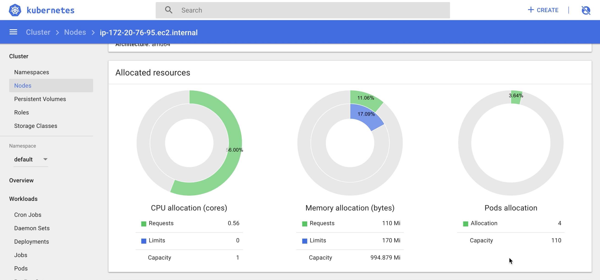

# Milestone 4 - Special Milestone

## Contribution:

- Anshuman Goel (agoel5) : Chaos Monkey for Load Balancer
- Divya Guttikonda (dguttik) : Node Monitoring
- Sarat Kavuru (skavuru) : Chaos Monkey for Kubernetes instances
- Tanmay Goel (tgoel) : High Availability & Video Making

## Screencast
[Screencast for Demo of  Infrastructure and Deployment Milestone](https://youtu.be/ZvV_WB1IY7I)

## Report

### Few Notes:

- The ansible-vault file should be named __creds.yml__ and the following credentials should be stored in as key:value pairs (DOTOKEN : 'xxx').
  - AWSAccessKeyId
  - AWSSecretKey
  - git_username
  - git_password
  - vault_password
 - AWSAccessKeyId, AWSSecretKey are the accesskeyId and secretKey of an AWS account and git_username, git_password  are the username and password of a Github Ncsu Enterprise account while vault_password is the password of the ansible vault.
- Create an SSH key pair with the name DevOps with your AWS account and store the file in the [Milestone4](../Milestone4) directory. Make sure that this key file has read-write permissions 0400 or 0600.
- All the variables required for [checkbox.io](https://github.com/anshuman-goel/checkbox.io) are in the file [checkboxvar.yml](../Milestone4/checkboxvar.yml) and they can be modified as required.
- The Node.js file [aws.js](../Milestone4/aws.js) should always be called with ServerName as an argument while the number of servers is optional.
- The commands to run each playbook are placed as comment at the top of of each playbook.
- The ansible-playbook [node.yml](../Milestone4/node.yml) is used to configure a local vm and then run aws.js to provision a remote server for Jenkins.
- The ansible-playbook [JenkinsConfig.yml](../Milestone4/JenkinsConfig.yml) is used to install all the dependencies, setup Jenkins  setup jenkins jobs for Checkbox and iTrust and start the build on a remote server.
- [DockerfileCheckBox](../Milestone4/DockerfileCheckBox) , [DockerfileCheckBoxCanary](../Milestone4/DockerfileCheckBoxCanary), [DockerfileRedisMaster](../Milestone4/DockerfileRedisMaster) and [DockerfileMongoDB](../Milestone4/DockerfileMongoDB) are files used in configuring the kubernetes cluster and implementing a canary release for checkbox.io application.
- [Kubernetes.yml](../Milestone4/kubernetes.yml) is an ansible playbook that sets up and configures the kubernetes cluster for Checkbox. It is also used to Kubernetes Dashboard.
- The ansible-playbook [milestone.yml](../Milestone4/milestone.yml) is an outer level playbook which executes node.yml and JenkinsConfig.yml playbook and thus automating the entire Milestone 4 to a single step.
- The node script [aws_terminate.js](../Milestone4/aws_terminate.js) is the chaos monkey script to randomly delete a master node of Kubernetes cluster.
- The node script [aws_lb_terminate.js](../Milestone4/aws_lb_terminate.js) is the chaos monkey script to delete the load balancer which enables the access to checkbox application.

### High Availability

The implemention for Checkbox in Milestone 3 was in one availability zone. In this Milestone, Kubernetes instances were deployed and maintained on different availability zones to offer protection against zonal outages. Earlier, we used a single master node. So to attain higher availability now, we've used more than one master node to protect the cluster against the single point of failure.

### Chaos Experiments

We've designed two chaos experiments for this milestone.
First, a chaos monkey is written in Nodejs which radomly deletes a Kubernetes master node. Due to implementation of multiple master nodes in Kubernetees, we made sure that the application is still up and running.
Second, another chaos monkey is designed to delete the load balancer. After executing this monkey, the application is not reachable and load balancer needs to created again manually.

### Nodes Monitoring

Since the Kubernetes cluster is deployed on multiple nodes, the health of each node needs to be monitored. To monitor the health of each node, Kubernetes Dashboard has been deployed so that the CPU and memory usage in real time can be under constant surveillance.

 